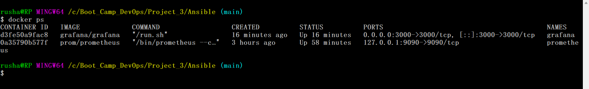
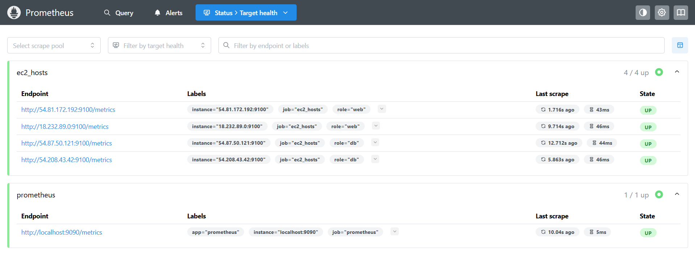
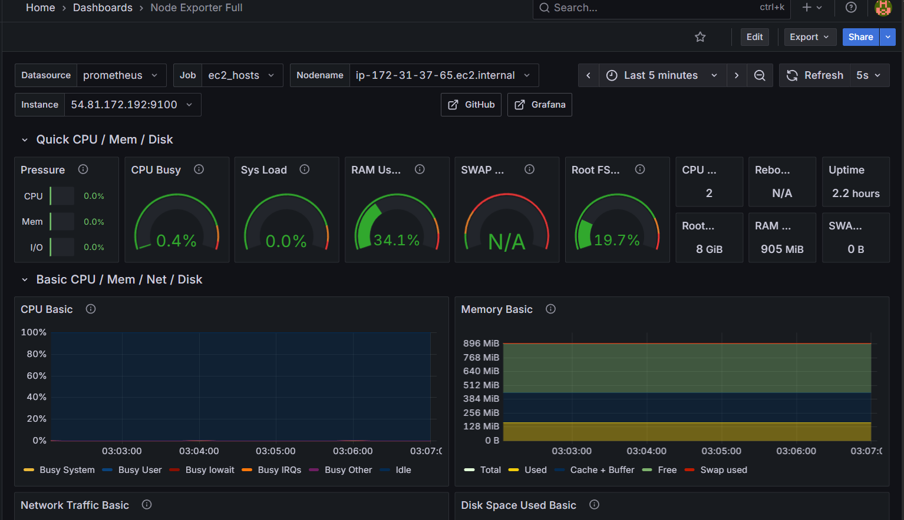
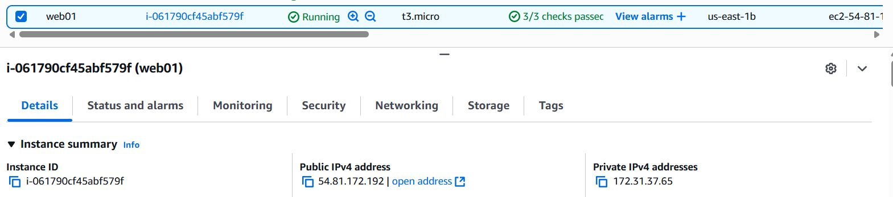

# Project 3

Setup Github repo


Create Workflows yaml for automation

```
name: Ansible

on:
  push:
    branch:
      - main

jobs:
  build:
    runs-on: ubuntu-latest


    steps:
      - name: Checkout repository
        uses: actions/checkout@v3

      - name: list
        run: ls -la

      - name: Set up SSH key
        run: |
          mkdir -p ~/.ssh
          echo "${{ secrets.ANSIBLE_PRIVATE_KEY }}" > ~/.ssh/ansible.pem
          chmod 600 ~/.ssh/ansible.pem

      - name: ping
        run: ansible all -i inventory.yaml -m ping

```

Confirming if the Workflow runs while push or not


## Ansible Playbooks

Create playbook for installing the node exporter to scrape all the instance

```
---
- name: Install and run Node Exporter
  hosts: all
  become: yes

  vars:
    node_exporter_version: "1.9.1"
    node_exporter_url: "https://github.com/prometheus/node_exporter/releases/download/v{{ node_exporter_version }}/node_exporter-{{ node_exporter_version }}.linux-amd64.tar.gz"
    node_exporter_port: "9100"
    node_exporter_user: "nodeusr"
    node_exporter_dir: "/opt/node_exporter-{{ node_exporter_version }}.linux-amd64"

  tasks:
    - name: Ensure node_exporter user exists
      ansible.builtin.user:
        name: "{{ node_exporter_user }}"
        shell: /sbin/nologin

    - name: Remove previous Node Exporter tarball if exists
      ansible.builtin.file:
        path: "/tmp/node_exporter.tar.gz"
        state: absent

    - name: Remove previous Node Exporter directory if exists
      ansible.builtin.file:
        path: "/opt/node_exporter"
        state: absent

    - name: Download Node Exporter tarball
      ansible.builtin.get_url:
        url: "{{ node_exporter_url }}"
        dest: "/tmp/node_exporter.tar.gz"
        mode: '0644'

    - name: Extract Node Exporter
      ansible.builtin.unarchive:
        src: "/tmp/node_exporter.tar.gz"
        dest: "/opt/"
        remote_src: yes
        creates: "{{ node_exporter_dir }}/node_exporter"

    - name: Ensure Node Exporter binary is executable 
      ansible.builtin.file:
        path: "{{ node_exporter_dir }}/node_exporter"
        owner: "{{ node_exporter_user }}"
        group: "{{ node_exporter_user }}"
        mode: '0755'

    - name: Create systemd service for Node Exporter
      ansible.builtin.copy:
        dest: /etc/systemd/system/node_exporter.service
        content: |
          [Unit]
          Description=Node Exporter
          After=network.target

          [Service]
          User={{ node_exporter_user }}
          ExecStart={{ node_exporter_dir }}/node_exporter --web.listen-address=":{{ node_exporter_port }}"
          Restart=always

          [Install]
          WantedBy=multi-user.target
      notify:
        - Reload systemd
        - Restart node_exporter

    - name: Enable and start Node Exporter
      ansible.builtin.systemd:
        name: node_exporter
        enabled: yes
        state: started

    - name: Ensure Node Exporter service is running
      ansible.builtin.systemd:
        name: node_exporter
        state: started
        enabled: yes


  handlers:
    - name: Reload systemd
      ansible.builtin.command:
        cmd: systemctl daemon-reload

    - name: Restart node_exporter
      ansible.builtin.systemd:
        name: node_exporter
        state: restarted

  
```

## Reporting Dashboard

I have my promethous and graphana running on my local Docker desktop 



Promethous having the scrape target as my web instances 



The below image shows how the promethous scrapes the web instances 




