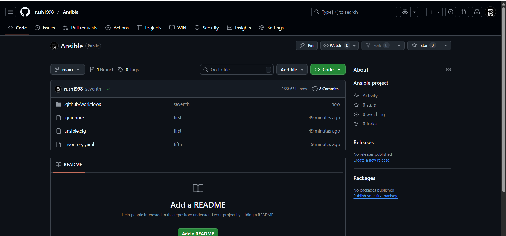
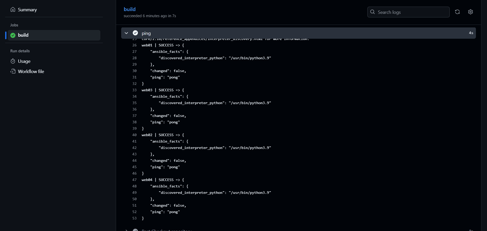

# Project 3

Setup Github repo 



Create Workflows yaml for automation 

```
name: Ansible

on:
  push:
    branch:
      - main

jobs:
  build:
    runs-on: ubuntu-latest


    steps:
      - name: Checkout repository
        uses: actions/checkout@v3

      - name: list
        run: ls -la

      - name: Set up SSH key
        run: |
          mkdir -p ~/.ssh
          echo "${{ secrets.ANSIBLE_PRIVATE_KEY }}" > ~/.ssh/ansible.pem
          chmod 600 ~/.ssh/ansible.pem

      - name: ping
        run: ansible all -i inventory.yaml -m ping

```


Workflow runs while push 


